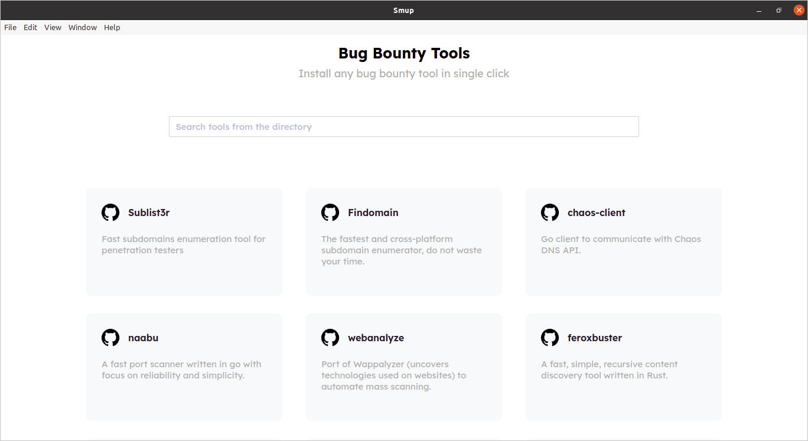
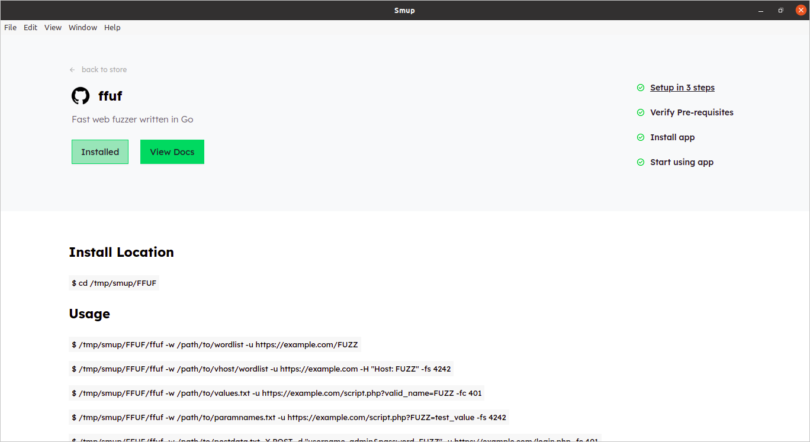
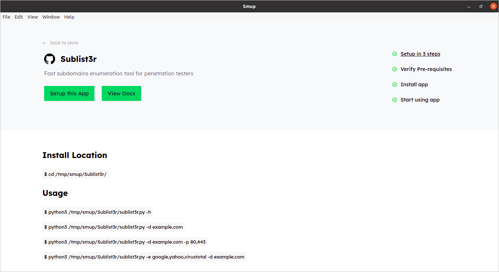

<div align="center">


# Smup - Bug Bounty Tools Store

Bug bounty tools store, variety of tools at one place with easy to search and single click installation options.

</div>

## Download

- [Linux x64](https://www.dropbox.com/s/b3zjb7vms8mb1pj/smup_0.0.1_amd64.deb)
- [MacOS](https://www.dropbox.com/s/397mv3nak0yroa1/smup_0.0.1.dmg)


## Screenshots


<div align="center">



</div>


## Local Setup


- Install dependencies

```
yarn
```

- Start dev server

```
yarn run dev
```

- Production build

```
yarn run build
```

